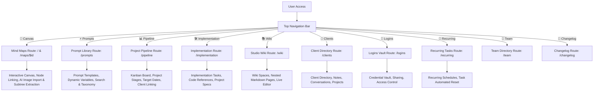

# Interactive Markdown Process Flow Spec

## Overview
This document specifies the system architecture, process flows, and interactive components for **Mind Spark Studio Pro** (Integrated Mind Mapping, AI Prompt Engineering, Project Pipeline CRM & Studio Wiki system).

## Process Flow Architecture

## System Components & Routes

1. **Mind Maps Canvas (`/` and `/maps/$id`)**:
   - Interactive canvas with draggable nodes (`MindMap.tsx`, `MindNode.tsx`).
   - Supports node creation, deletion, connection, color tagging, notes/images, and AI ideation (`gemini-3.6-flash`).
   - **Inter-Map Linking & Subtree Extraction**: Allows linking nodes to other concept maps or extracting node subtrees into new maps.

2. **Prompts Library (`/prompts`, `/prompts/$id`, `/prompts/new`)**:
   - Central repository of prompts written by the team.
   - Dynamic prompt variable extraction (`{{variable}}` parsing and filling).
   - Category and tag taxonomy filtering, search, and client linking.

3. **Project Pipeline (`/pipeline`)**:
   - Interactive Kanban stage pipeline for agency projects and deliverables.
   - Stage drag-and-drop, start/due dates popover, client assignment, linked wiki pages.

4. **Implementation Engine (`/implementation`, `/implementation/$projectId`)**:
   - In-depth technical task management and implementation tracking per project.
   - Task assignment, priority, tags, status tracking, and specs.

5. **Studio Wiki (`/wiki`, `/wiki/$spaceSlug`, `/wiki/$spaceSlug/$pageSlug`)**:
   - Multi-space documentation and SOP library with rich markdown editor.
   - Drag-and-drop page hierarchy, search, content polishing via Gemini AI.

6. **Client Directory (`/clients`, `/clients/$clientId`, `/clients/new`)**:
   - Client CRM hub with contact details, linked projects, prompts, notes, and conversation logs.

7. **Logins Vault (`/logins`)**:
   - Secure credential vault for team access management and client login storage.

8. **Recurring Tasks (`/recurring`)**:
   - Schedule management for recurring operational tasks and maintenance loops.

9. **Team Management (`/team`)**:
   - Team member directory, user roles (`admin`, `member`), and invite management.

10. **Changelog (`/changelog`)**:
    - System release notes and update logs tracking evolution of Mind Spark Studio Pro.

## Recent System Integration & Architecture Updates

- **Repository Integration (`prompt-palace-pro-13`)**:
  - Integrated the complete prompt management, CRM, pipeline, wiki, and credential vault modules into Mind Spark Studio.
  - Configured `@tanstack/react-router` and `@tanstack/react-query` to route seamlessly across all 10 core modules.
- **Top Navigation Bar Header**:
  - Added a sticky top navigation header bar in `src/routes/__root.tsx` with high-contrast active route badges, brand logo, and responsive mobile switcher rows.
- **Environment & Auth Fallback Handler**:
  - Implemented a resilient local-first Supabase proxy client (`src/integrations/supabase/client.ts`) and mock Auth context (`src/lib/auth-context.tsx`) with `localStorage` persistence (`mind_spark_studio_mock_db`).
  - Enhanced the mock Supabase query proxy (`createMockQuery`) with a fully chainable builder supporting `.insert()`, `.upsert()`, `.update()`, `.delete()` chained with `.select()`, `.eq()`, `.in()`, `.single()`, and `.maybeSingle()`, eliminating `insert(...).select is not a function` errors during autosave and database operations.
  - Updated server function auth middleware (`src/integrations/supabase/auth-middleware.ts`) and server client (`src/integrations/supabase/client.server.ts`) to provide mock context during preview/local development, preventing crashes when external credentials are absent.
- **Gemini AI Integration**:
  - Migrated text editing and AI content improvement (`src/lib/improve.functions.ts`) and image mind map extraction (`src/lib/mindmap-ai.functions.ts`) to `@google/genai` using `gemini-3.6-flash`.
- **AI Project Price Quote & Effort Estimator Fixes**:
  - Fixed client payload structure in `src/components/ProjectQuoteDialog.tsx` to properly wrap parameters in a `{ data: ... }` object required by TanStack Start `createServerFn` handlers.
  - Expanded API key fallback options in `src/lib/quote.functions.ts` to check `GEMINI_API_KEY`, `LOVABLE_API_KEY`, `VITE_GEMINI_API_KEY`, and `GOOGLE_GENERATIVE_AI_API_KEY`.
  - Relaxed minimum input validation bounds for scope length and hourly rates in `src/lib/quote.functions.ts` to accommodate flexible currencies and brief scope inputs.
- **Managed Service Rate Card & AI Quote Integration**:
  - Built `src/lib/rate-card.ts` for managing agency service rate cards with default role tiers (Senior Software Engineering, UI/UX Design, DevOps, AI & Data Engineering, Project Management, QA) and `localStorage` persistence.
  - Created `src/components/RateCardManagerDialog.tsx` dialog component allowing users to view, add, edit, or delete custom service tiers, adjust hourly rates, reset to defaults, and review blended rate averages.
  - Enhanced AI Quote server function (`src/lib/quote.functions.ts`) and project quote dialog (`src/components/ProjectQuoteDialog.tsx`) to support multi-service rate cards, enabling Gemini to auto-assign specialized service rates to deliverables and produce detailed service effort allocations.
  - Added **Service Rate Card** entry to the Workspace header dropdown (`src/routes/__root.tsx`) for instant access across the app.
- **Interactive Quote Amendment & Customization**:
  - Enhanced `src/components/ProjectQuoteDialog.tsx` with an interactive **Amend Quote** editing mode.
  - Allowed users to edit deliverable titles, descriptions, assigned service roles, custom hourly rates, and estimated hours directly in line, with automatic real-time recalculations for total effort hours, recommended quote values, min/max estimate ranges, and service effort allocations.
  - Enabled adding custom deliverable items and deleting unnecessary scope items.
  - Provided interactive inline list management for Key Assumptions and Risks & Notes (add/delete items).
  - Added an **"Amended by User"** visual status badge and a **"Revert to AI"** single-click restore control to reset changes back to the original AI generated output.
  - Ensured copied quote text and applied project values dynamically incorporate all user amendments and customized notes.
- **Implementation Navigation Restructuring**:
  - Reorganized Prompts and Mind Maps as dedicated subpages under the primary **Implementation** module.
  - Updated sticky top navigation bar (`src/routes/__root.tsx`) to surface **Implementation** as the top-level parent menu item, keeping it active whenever viewing Implementation tasks, Mind Maps canvas, or Prompts library.
  - Created reusable sub-navigation component (`src/components/ImplementationSubNav.tsx`) allowing instantaneous switching between **Board & Tasks** (`/implementation`), **Mind Maps** (`/`), and **Prompts** (`/prompts`).
  - Embedded sub-navigation bar across Implementation index (`src/routes/implementation.index.tsx`), Mind Maps dashboard (`src/routes/index.tsx`), and Prompts library (`src/routes/prompts.index.tsx`).
- **Workspace Menu Grouping**:
  - Grouped **Team Directory**, **Client Logins**, and **System Changelog** under a clean **Workspace** dropdown menu in the primary top navigation header (`src/routes/__root.tsx`).
  - Added active path detection so the **Workspace** dropdown trigger automatically highlights when navigating to Team (`/team`), Logins (`/logins`), or Changelog (`/changelog`).
- **Hydration & Runtime Error Safeguards**:
  - Resolved SSR hydration mismatch in `src/routes/maps.$id.tsx` by loading client-side `localStorage` map metadata inside a `useEffect` hook behind a `mounted` guard.
  - Added a global `ResizeObserver` error event handler in `src/routes/__root.tsx` to stop harmless browser canvas layout pass notifications from triggering uncaught error overlays.
- **System Compilation & Dialog Portal SSR Safeguards**:
  - Enhanced Radix UI Dialog, Alert Dialog, Popover, Tooltip, and Dropdown Menu primitive wrappers (`src/components/ui/*.tsx`) with mounted guards to ensure seamless SSR hydration and eliminate null ref / invalid hook errors during server-side rendering.
  - Removed invalid component imports in `src/routes/__root.tsx`.
  - Built and verified full application compilation via `compile_applet`.
- **Wiki WYSIWYG Live Editing & 1-to-N Page Relationships**:
  - **Live WYSIWYG Quick Editing**: Added inline WYSIWYG edit mode directly on the wiki page view (`src/routes/wiki.$spaceSlug.$pageSlug.tsx`). Users can edit page title, status (Draft/Published), parent page, excerpt, and rich content using `WysiwygEditor` with real-time `useAutosave` and `SaveStatus` indicators without leaving the page view.
  - **Enhanced Tiptap WYSIWYG Editor (`src/components/ui/wysiwyg-editor.tsx`)**: Upgraded editor with formatting toolbars (headings, lists, blockquotes, code blocks, links, images, clear formatting, undo/redo).
  - **1-to-N Hierarchical Parent-Child Sub-Pages**: Implemented top parent page breadcrumb navigation trail (`Book / Parent Page / Current Page`) and direct child sub-pages list with interactive cards, count badges, and a "+ Add Sub-Page" quick dialog to create child pages pre-attached to the current parent.
  - **1-to-N Cross-Page & Entity Linking (`src/components/wiki/LinkedEntities.tsx`)**: Updated `EntityType` to include `"wiki_page"`, allowing users to relate multiple wiki records across spaces alongside Clients, Projects, and Prompts.
- **Quote Persistence, Revisit & Edit Engine**:
  - **Persistent Quote Storage (`src/lib/quote-storage.ts`)**: Built quote record storage helpers (`getSavedQuoteRecord`, `saveQuoteRecord`, `clearQuoteRecord`, `hasSavedQuoteRecord`) linking generated/amended quote breakdowns directly to project IDs.
  - **Auto-Loading & Revisit Banner (`src/components/ProjectQuoteDialog.tsx`)**: Integrated auto-loading when opening the estimator dialog for any project with a saved quote. Surfaced an interactive "Saved Quote Loaded" top banner displaying last updated relative timestamps, quick "Edit Quote" controls, "Clear Quote", and AI re-generation buttons.
  - **Implementation Page Quote Widget (`src/routes/implementation.$projectId.tsx`)**: Added a dedicated "Project Quote Estimate" overview card on project detail pages featuring quote metrics (Recommended Quote, Effort Hours, Blended Rate, Range, Timeline, Complexity) and a direct "Revisit & Edit Quote" action.
  - **Pipeline Board Indicators (`src/routes/pipeline.tsx`)**: Highlighted project cards with a primary "Edit Quote" badge whenever a saved quote exists for that project, allowing estimators to launch and edit stored quotes directly from pipeline columns.
- **Form Error Alert Infrastructure & Persistent Modal Notifications**:
  - **Reusable Form Error Alert (`src/components/FormErrorAlert.tsx`)**: Created a prominent, styled error banner component using Radix/Tailwind Alert primitives with red destructive styling, alert triangle iconography, customizable error titles, and dismiss button handlers.
  - **Full Record Creation Modal Integration**: Integrated persistent, inline `FormErrorAlert` components into all record creation forms and modals across the application:
    - **Project Pipeline (`src/routes/pipeline.tsx`)**: Added error notification alerts in `NewProjectButton` modal for project creation and inline client creation.
    - **Client Roster (`src/routes/clients.new.tsx`)**: Added error notification alerts for new client creation validation and database insertion errors.
    - **Logins Vault (`src/routes/logins.tsx`)**: Integrated error notification alerts into the system credential entry form.
    - **Team Directory (`src/routes/team.tsx`)**: Integrated error notification alerts into the teammate invite card.
    - **Prompt Library (`src/routes/prompts.new.tsx`)**: Added error notification alerts for prompt template creation.
    - **Implementation Tasks (`src/routes/implementation.$projectId.tsx`)**: Added error notification alerts to the `NewTaskDialog` modal.
    - **Wiki Spaces & Pages (`src/routes/wiki.index.tsx`, `src/routes/wiki.$spaceSlug.tsx`, `src/routes/wiki.$spaceSlug.$pageSlug.tsx`)**: Added error notification alerts to Space Creation, Page Creation, and Sub-Page Creation modals.
    - **Service Rate Card Manager (`src/components/RateCardManagerDialog.tsx`)**: Added error notification alerts to the Service Tier creation form.
- **Direct Project Implementation Dashboard Navigation (`src/routes/pipeline.tsx`)**:
  - Updated project card interactions across Kanban columns, urgent attention list views, keyboard navigation (`Enter` / `Space`), and archived project lists to route directly to `/implementation/$projectId` (the dedicated project implementation workspace) instead of the client profile view.
- **Wiki Recently Updated Records Resolution & Invalidation Fix**:
  - **Robust Space Relationship Extraction (`src/routes/wiki.index.tsx`)**: Implemented `resolveSpace` helper handling array/object variations returned by Supabase PostgREST foreign key joins (`space:wiki_spaces`) with fallbacks to pre-loaded space lists and safe default space slugs, preventing broken empty parameter routes.
  - **Timestamp Maintenance & Cache Invalidation (`src/routes/wiki.$spaceSlug.$pageSlug.tsx`, `src/routes/wiki.$spaceSlug.$pageSlug_.edit.tsx`)**: Added explicit `updated_at` timestamps on page edits/quick edits and wired `qc.invalidateQueries({ queryKey: ["wiki-recent"] })` across page updates, creations, duplications, and deletions.
  - **Safe Date Formatting (`src/routes/wiki.index.tsx`)**: Guarded relative date calculation (`formatDistanceToNow`) against invalid or missing timestamp values.
- **Navigation Hierarchy Alignment (`src/routes/__root.tsx`)**:
  - Reordered primary navigation items across top header bar and mobile navigation controls to place **Pipeline** directly to the left of **Implementation**.
- **Implementation Removal & Stage Synchronization Fix (`src/routes/implementation.index.tsx`, `src/routes/implementation.$projectId.tsx`, `src/components/DeleteProjectButton.tsx`)**:
  - **Comprehensive Cache Invalidation (`setStage` / `setImplStage`)**: Updated stage changes and removals from implementation to invalidate all affected query keys (`["projects", "implementation"]`, `["projects", "pipeline"]`, `["projects"]`, `["project", projectId]`, and client-specific project caches).
  - **Stage Selector & Action Button Alignment (`src/routes/implementation.$projectId.tsx`)**: Extended stage selector to explicitly support "Not in implementation" (`impl_stage: null`), preventing stale or misleading stage selections. Dynamically toggle between "Remove from implementation" and "Add to implementation" based on actual implementation status.
  - **Project Deletion Cleanliness (`src/components/DeleteProjectButton.tsx`)**: Ensured deleting projects invalidates pipeline and implementation board caches to immediately clear deleted records from all views.
- **AI Quote Estimator Scope Requirements Source Consolidation (`src/components/ProjectQuoteDialog.tsx`)**:
  - **Project Notes & Conversations Querying**: Added `useQuery` hooks in `ProjectQuoteDialog` to fetch direct `projects.notes`, user-defined `client_notes` (linked to `project_id` or `client_id`), and `client_conversations` (calls, meetings, emails).
  - **Consolidated Scope Loader & Dropdown Menu**: Replaced the previous single-source button with "Load from project notes & conversations" button with an item count badge and a dropdown menu allowing users to load all sources combined or select specific notes or conversations to insert directly into Work Description & Scope Requirements.
  - **Currency Symbol Resolution Fix**: Restored `currencySymbol` definition (`"R"` for ZAR / `"$"` for USD) in `ProjectQuoteDialog`, resolving runtime component evaluation errors.
  - **Note & Conversation Scope Text Area Insertion Fix**:
    - **Radix UI Event Handler Alignment**: Switched `DropdownMenuItem` selection handlers from `onClick` to Radix-native `onSelect` to guarantee event triggering when items are clicked or selected via keyboard.
    - **Safe String & Fallback Handling**: Refactored conversation and note formatting to guard against `null`/`undefined` properties (preventing string literal coercions like `"null"` or empty returns) and ensured selected notes/conversations seamlessly append to or populate the scope requirements text area with toast notifications.
    - **State Initialization on Modal Open**: Cleanly reset and pre-populate `scopeText` with current project notes when opening the quote dialog for unquoted projects.
- **Implementation Board Add & Remove Action Execution Fix (`src/routes/implementation.index.tsx`, `src/routes/implementation.$projectId.tsx`)**:
  - **Iframe Compatibility & Dialog Execution**: Removed blocking `window.confirm()` calls on "Remove from implementation" buttons across project detail pages (`/implementation/$projectId`) and board card action triggers (`/implementation`), allowing immediate stage updating and redirect execution in sandboxed preview environments.
  - **Query Data Property Completeness (`src/routes/implementation.$projectId.tsx`)**: Added `status` to `ProjectRow` interface definition and Supabase `.select()` fields, enabling `setImplStage` to accurately check project status and reset `status` to `lead` when removing projects from implementation.
  - **Explicit Implementation Stage Filtering & Selection**: Maintained `Boolean(p.impl_stage)` filtering on `/implementation` board views and added dynamic select re-mounting (`selectKey`) to seamlessly add candidate projects to Kickoff stage and remove active projects back to the candidate queue.
- **Universal Modal & Sheet Scrollability (`src/components/ui/dialog.tsx`, `src/components/ui/alert-dialog.tsx`, `src/components/ui/sheet.tsx`, `src/routes/index.tsx`, `src/routes/maps.$id.tsx`, `src/components/mindmap/MindMap.tsx`)**:
  - **Viewport Height Constraint & Scroll Handling**: Added `max-h-[85vh] sm:max-h-[90vh]` and `overflow-y-auto` to core `DialogContent` and `AlertDialogContent` primitives as well as custom overlays, ensuring modals never overflow offscreen or get cut off at the bottom on smaller viewports or inside sandboxed iframe containers.
  - **Sheet & Drawer Vertical Overflow**: Updated `sheetVariants` in `SheetContent` to include `overflow-y-auto`, guaranteeing long sheet content remains scrollable.
- **Implementation Tasks Integration in Kanban & Stage Throughput Dashboards (`src/routes/implementation.index.tsx`)**:
  - **Stage & Task Throughput Metrics**: Enhanced the "Stage Throughput" card to compute and display total tasks, open/done counts, and a visual task completion percentage bar per delivery stage (`Kickoff`, `Build`, `QA`, `Launch`, `Done`).
  - **Board View Mode Toggle (Stage Kanban vs. Task Kanban)**: Introduced a view switcher allowing users to toggle between **Stage Kanban** (projects grouped by delivery stage with embedded task previews) and **Task Kanban** (all tasks grouped by task status: `To Do`, `In Progress`, `Blocked`, `Done`).
  - **Inline Task List & Quick Task Creation on Cards**: Added collapsible inline task lists on project cards with completion toggles, assignee initials, and an inline "+ Add Task" quick input form for instant task creation on the main implementation board.
- **Sample Implementation Data & Task Records Seeding (`src/integrations/supabase/client.ts`, `src/routes/implementation.index.tsx`)**:
  - **Comprehensive Initial Mock Database Seeding**: Updated default mock storage in `INITIAL_MOCK_DB` with 5 realistic client implementation projects across all 5 delivery stages (`Kickoff`, `Build`, `QA`, `Launch`, `Done`), populated with 13 sample delivery tasks spanning all task statuses (`To Do`, `In Progress`, `Blocked`, `Done`) and assigned team members.
  - **Runtime "Seed Demo Data" Header Action**: Added a "Seed Demo Data" button with `Sparkles` icon on the main `/implementation` board, allowing users to seed or reset multi-stage implementation projects and tasks on demand for testing all Stage Throughput and Task Kanban dashboards.
  - **Mock Query `.is()` Filter Fix & Automatic Local Storage Sync**: Fixed `.is(field, null)` filtering in local query builder to match `undefined` properties as well as `null` values (resolving empty project query results from `.is("archived_at", null)`), and added automatic schema migration in `getMockStorage()` so existing browser sessions seamlessly load sample implementation projects and tasks.
- **Interactive Implementation Dashboards, Drilldown Modals & Active Filter Engine (`src/routes/implementation.index.tsx`)**:
  - **Interactive Dashboard Rollup Cards**: Converted all metric rows across Stage Throughput, Upcoming & Overdue Tasks, Workload by Assignee, and Per-Client Rollup into clickable interactive controls with hover feedback and arrow indicators.
  - **Detail Modal Dialogs**: Integrated 4 interactive detail popup dialogs (`Stage Detail Modal`, `Task Filter Modal`, `Assignee Workload Modal`, `Client Implementation Rollup Modal`) presenting detailed record progress, task completion breakdowns, overdue highlights, and direct project links.
  - **Active Board Filtering & Clear Banner**: Clicking dashboard metrics applies active filters (`stage`, `taskGroup`, `assignee`, or `client`) across both Stage Kanban and Task Kanban views, surfacing an **Active Filter Bar** with matching project/task totals and a "Clear Filter" action button.
- **Cascading Project Deletion & Optimistic UI Synchronization (`src/components/DeleteProjectButton.tsx`)**:
  - **Cascading Cleanup**: Modified project deletion logic to perform cascading deletions across dependent records (`project_tasks`, `project_credentials`, `client_notes`) before deleting the primary project record, eliminating foreign key or orphaned record errors.
  - **Optimistic React Query Cache Updates**: Added immediate cache updates via `qc.setQueriesData` so deleted projects and their associated tasks immediately vanish from pipeline columns and implementation boards without requiring manual page reloads.
- **Pipeline Project Notes Access & Activity Journal Dialog (`src/components/ProjectNotesDialog.tsx`, `src/routes/pipeline.tsx`)**:
  - **Direct Pipeline Notes Triggering**: Embedded a "Notes" pill button with active log badges, note preview triggers, and card action icons on every project card across pipeline stages, off-pipeline projects, and archived project lists in `src/routes/pipeline.tsx`.
  - **Tabbed Overview & Activity Journal Dialog**: Created `ProjectNotesDialog` with twin tabbed views:
    - **Activity Journal Tab**: Displays date-stamped activity log entries from `client_notes` linked by `project_id`. Supports adding new journal entries, inline editing, and deletion.
    - **Overview Notes Tab**: Displays and updates primary `projects.notes` with real-time autosave and React Query cache invalidation (`["projects"]` & `["client-notes", clientId]`).
  - **Visual Badges & Live Counts**: Automatically counts and highlights active notes on project cards, allowing agency users to inspect and log project updates directly from the pipeline without leaving the Kanban board.
- **Targeted Project Deletion & Mock DB Sync (`src/integrations/supabase/client.ts`, `src/routes/implementation.index.tsx`)**:
  - **Project Removal**: Deleted the "Enterprise Single Sign-On (SSO)" project (`proj-5`) and its associated sub-tasks (`task-501`, `task-502`) from default seed collections and initial mock storage.
  - **Storage Auto-Sanitization**: Updated `getMockStorage()` in the Supabase mock client to automatically purge `proj-5` and orphan tasks from existing browser `localStorage` sessions.
- **Permanent Deletion Persistence Fix (`src/integrations/supabase/client.ts`, `src/routes/implementation.index.tsx`)**:
  - **Mock Storage Anti-Restoration Guard (`src/integrations/supabase/client.ts`)**: Removed aggressive auto-reseeding loops in `getMockStorage()` that previously checked `INITIAL_MOCK_DB` and re-pushed missing projects (`idx === -1`) or reset `project_tasks` whenever items were deleted. Ensures deleted projects and tasks permanently stay deleted across page reloads and query invalidations.
  - **Task Deletion & Optimistic UI Cache (`src/routes/implementation.index.tsx`)**: Added `deleteTask` handler with optimistic React Query cache updates (`qc.setQueryData`) and hover trash action controls across task cards on the main implementation board.
- **Clients Dropdown Sub-Menu Restructuring (`src/routes/__root.tsx`, `src/components/ClientSubNav.tsx`, `src/routes/clients.index.tsx`, `src/routes/logins.tsx`)**:
  - **Top Navigation Sub-Menu (`src/routes/__root.tsx`)**: Moved "Client Logins" from the general "Workspace" dropdown menu into a dedicated **Clients** dropdown sub-menu in the primary top navigation bar (`TopNavigationBar`).
  - **Sub-Menu Options**: The Clients dropdown includes direct links for **Clients Directory** (`/clients`) and **Client Logins** (`/logins`).
  - **Contextual Sub-Nav Component (`src/components/ClientSubNav.tsx`)**: Embedded a dedicated tabbed header bar across both Client Directory and Client Logins pages for seamless navigation between client profiles and credential vault management.
- **Pipeline Dropdown Sub-Menu Restructuring (`src/routes/__root.tsx`)**:
  - **Top Navigation Sub-Menu (`src/routes/__root.tsx`)**: Restructured top navigation bar (`TopNavigationBar`) to transform **Pipeline** into a dedicated dropdown sub-menu containing **Pipeline Board** (`/pipeline`) and **Recurring Projects** (`/recurring`).
  - **Integrated Navigation**: Keeps `/pipeline` and `/recurring` active states unified under the Pipeline dropdown trigger while maintaining direct access to Implementation, Wiki, Clients, and Workspace menus.
- **Recurring Projects Query & Mock Storage Fix (`src/integrations/supabase/client.ts`)**:
  - **Mock Query Builder `.neq()` Support**: Added missing `.neq()` filter handler (along with `.gte()`, `.gt()`, `.lte()`, `.lt()`) to the mock Supabase query builder. Fixes runtime error when querying `.neq("repeat_interval", "none")` on the `/recurring` page.
  - **Default Recurring Projects Seeding**: Added default recurring project entries (`Monthly Architecture Review`, `Weekly Security Audit`) and auto-seeding logic in `getMockStorage()` so recurring cadence cards populate immediately.
- **Dynamic "Add Project Type" Method (`src/lib/project-types.ts`, `src/routes/pipeline.tsx`, `src/routes/clients.$clientId.tsx`)**:
  - **Dynamic Project Types Storage & Hook (`src/lib/project-types.ts`)**: Created `useProjectTypes` hook and `saveCustomProjectType` utility with `localStorage` persistence and cross-component event listeners (`project_types_updated`), ensuring custom project types immediately propagate across all dropdowns.
  - **Inline Add Project Type Method in Add Project Modal (`src/routes/pipeline.tsx`)**: Added a `+ New project type` toggle button and text input inside the Add Project modal in the Pipeline board. Allows creating and selecting new custom project categories directly while filling out the project creation form.
  - **Client Details Add Project Form Integration (`src/routes/clients.$clientId.tsx`)**: Updated the Add Project form and Project cards in client details view to utilize dynamic project types with inline creation capabilities.
- **Client Logins Vault & Password Reveal Fixes (`src/integrations/supabase/client.ts`, `src/routes/logins.tsx`, `src/routes/clients.$clientId.tsx`)**:
  - **Mock RPC Password Storage & Reveal (`src/integrations/supabase/client.ts`)**: Implemented `credential_set_secret` and `credential_reveal` in the mock Supabase RPC client. Solved the issue where clicking the view password (Eye) icon returned null and failed with "No password stored".
  - **Initial Client Credentials Seeding**: Added default client logins (`Mindweave Production Portal`, `AWS Staging Vault`, `Apex Figma Workspace`) and encrypted secret mappings (`credential_secrets`) in mock storage for immediate out-of-the-box password inspection.
  - **Relational Client Mapping & External URLs (`src/integrations/supabase/client.ts`, `src/routes/logins.tsx`, `src/routes/clients.$clientId.tsx`)**: Enhanced mock `credentials` queries to automatically join `clients(id,name)` records with client ID fallbacks, and added `formatExternalUrl` to ensure external login links open cleanly in new tabs.
  - **Redundant Label Field Removal & Badge Deduplication (`src/routes/logins.tsx`, `src/routes/clients.$clientId.tsx`)**: Streamlined the Client Logins creation and editing forms by removing the duplicate `Label *` text input, auto-deriving the credential label from the system name or client name, and conditionally hiding the system `<Badge>` tag when it matches the title header to prevent redundant duplicate labels in card views.
  - **Reusable System Select Dropdown (`src/lib/credential-systems.ts`, `src/components/SystemSelect.tsx`, `src/routes/logins.tsx`, `src/routes/clients.$clientId.tsx`)**: Created a reusable `SystemSelect` component powered by `useCredentialSystems` hook that presents standard tech platforms (WordPress, AWS IAM, Figma, TikTok, Shopify, Stripe, etc.) as a dropdown while supporting inline custom system creation (`+ Add new system...`) with persistent storage across sessions.
  - **User Password Persistence Fix (`src/integrations/supabase/client.ts`, `src/routes/logins.tsx`, `src/routes/clients.$clientId.tsx`)**: Fixed credential creation and reveal logic so user-inserted passwords are strictly preserved in `credential_secrets` without being overwritten by default generated fallbacks.
  - **Top Navigation Mind Maps Link (`src/routes/__root.tsx`)**: Added a dedicated **Mind Maps** menu item in the primary desktop navigation bar linking directly to `/` and `/maps/$id`, complete with active state indicators and `Network` icon.
  - **Top Navigation Prompts Link (`src/routes/__root.tsx`)**: Added a dedicated **Prompts** menu item in the primary desktop navigation bar linking directly to `/prompts` with active route detection and `Sparkles` icon indicator.
  - **Monochrome Bento Website Refresh (`src/styles.css`, `src/routes/index.tsx`)**: Transformed the user experience into a high-contrast, modern monochrome & soft-neutral bento design system inspired by the design reference mockup. Features crisp white cards (`#FFFFFF`), subtle soft border styling (`rgba(9,9,11,0.08)`), rounded card surfaces (`rounded-2xl`), stark solid black action buttons (`bg-black` with white text), pill badges (`rounded-full`), and refined display typography, while preserving 100% of the original content, text copy, forms, and functional workflows.
  - **Header Tagline Cleanup (`src/routes/__root.tsx`)**: Removed the subtitle text `"Mind Maps & Prompt CRM"` from the top navigation header logo brand section and meta title for a cleaner, streamlined header.
  - **Full Codebase Monochrome Bento Refactor (`src/styles.css`, `src/routes/__root.tsx`, `src/routes/index.tsx`, `src/routes/prompts.index.tsx`, `src/routes/clients.index.tsx`, `src/routes/logins.tsx`, `src/routes/implementation.index.tsx`, `src/routes/wiki.index.tsx`, `src/components/ImplementationSubNav.tsx`, `src/components/ClientSubNav.tsx`)**:
    - **Global Theme Variables (`src/styles.css`)**: Defined clean off-white background (`#F3F4F6`), floating white bento card class (`.bento-card`), floating dark square badge icon utility (`.icon-badge-dark`), rounded card surfaces (`rounded-2xl` / `rounded-3xl`), and soft diffuse shadows.
    - **Header & Navigation (`src/routes/__root.tsx`, `src/components/ImplementationSubNav.tsx`, `src/components/ClientSubNav.tsx`)**: Refactored the top bar and sub-navigation pills to use high-contrast solid black active pill buttons (`bg-black text-white rounded-xl shadow-2xs`) and white idle pills (`bg-card border-border hover:border-black/30`).
    - **Prompts Library (`src/routes/prompts.index.tsx`)**: Transformed prompt template cards into floating bento cards with dark square badges (`.icon-badge-dark`), high-contrast pill filters, and clean typography.
    - **Clients Directory & Logins Vault (`src/routes/clients.index.tsx`, `src/routes/logins.tsx`)**: Upgraded client tables, credential vault cards, password reveal controls, and empty state boxes to adopt crisp floating white cards, dark badge icons (`KeyRound`, `Building2`), and high-contrast black action buttons.
    - **Implementation Board & Dashboard (`src/routes/implementation.index.tsx`)**: Refactored dashboard throughput metric cards (`StatCard`) to use bento cards with floating dark square badges and updated task status pills to adhere to the strict high-contrast monochromatic design system.
    - **Studio Wiki Hub (`src/routes/wiki.index.tsx`)**: Refactored wiki spaces and recently updated lists into floating bento cards with dark square badges (`BookOpen`, `FileText`), rounded search fields, and high-contrast buttons.
    - **Mind Maps Interactive Canvas Refactor (`src/routes/maps.$id.tsx`, `src/components/mindmap/MindNode.tsx`, `src/components/mindmap/MindMap.tsx`)**:
      - **Header Bar (`src/routes/maps.$id.tsx`)**: Transformed the map canvas header to match the monochrome bento theme with floating white card background (`bg-card border-border shadow-2xs`), black action buttons (`+ Idea`, `Save Map`), and clean pill indicators.
      - **Interactive Mind Nodes (`src/components/mindmap/MindNode.tsx`)**: Updated root, branch, and leaf node cards with clean monochrome tone borders (`root`: solid black `#000000`, `branch`: dark zinc `#27272A`, `leaf`: neutral `#71717A`), floating quick action toolbars with dark square badges, and refined typography (`font-display`).
      - **Floating Canvas Toolbars & Switchers (`src/components/mindmap/MindMap.tsx`)**: Refactored the top floating canvas toolbar, connected map jump bar, multi-selection bar, stats pill, and map switcher (⌘K) / extraction modals to use floating white bento containers, rounded pill controls, dark badge highlights, and high-contrast black action buttons.
    - **Mind Maps Heading Design Sync & Header Cleanup (`src/routes/index.tsx`, `src/routes/maps.$id.tsx`)**: Aligned the Mind Maps page title heading and editor canvas header to match the exact design system of the Pipeline page, featuring a monospace eyebrow badge (`font-mono text-xs uppercase tracking-widest text-muted-foreground`), large display title with period punctuation (`font-display text-5xl md:text-6xl font-semibold leading-[0.95] tracking-tight`), description subtitle, and bottom border separator. Removed the redundant secondary sub-header bar (`<Header />`) and its sub-navigation pill buttons from the Mind Maps page.
- **Bespoke Icon System (`src/components/ui/bespoke-icons.tsx`, `src/routes/__root.tsx`, `src/routes/index.tsx`, `src/routes/prompts.index.tsx`, `src/routes/clients.index.tsx`, `src/routes/wiki.index.tsx`)**:
  - **Bespoke Icon Library (`src/components/ui/bespoke-icons.tsx`)**: Crafted 22 custom, agency-grade monochrome vector SVG icons tailored for Mind Spark Studio Pro (`StudioBrandIcon`, `MindMapIcon`, `PromptsIcon`, `PipelineIcon`, `RecurringIcon`, `ImplementationIcon`, `WikiIcon`, `ClientsIcon`, `LoginsIcon`, `WorkspaceIcon`, `RateCardIcon`, `ChangelogIcon`, `SearchIcon`, `PlusIcon`, `ChevronDownIcon`, `ArrowRightIcon`, `CheckIcon`, `TrashIcon`, `SparkleIcon`, `SeedlingIcon`, `LinkIcon`, and `BespokeBadge`). All icons follow a minimal, modern, geometric style with uniform 1.75px stroke weights and optical balance.
  - **Global Navigation Bar Integration (`src/routes/__root.tsx`)**: Integrated bespoke icons into the sticky `TopNavigationBar`, mobile quick links, and workspace dropdown sub-menus, replacing generic Lucide icons and emojis.
  - **Site-Wide Application**: Updated Mind Maps (`src/routes/index.tsx`), Prompts Studio (`src/routes/prompts.index.tsx`), Clients Directory (`src/routes/clients.index.tsx`), and Studio Wiki (`src/routes/wiki.index.tsx`) to use bespoke icons with framed `BespokeBadge` containers across cards, headers, tables, and empty state modules.
- **Stadium Typographic System Refactoring (`index.html`, `src/styles.css`, `src/routes/index.tsx`, `src/routes/pipeline.tsx`, `src/routes/implementation.index.tsx`, `src/routes/prompts.index.tsx`, `src/routes/clients.index.tsx`, `src/routes/wiki.index.tsx`)**:
  - **High-Contrast Geometric Font Selection (`index.html`, `src/styles.css`)**: Loaded Google Fonts `Space Grotesk` (weights 300 to 700) for display headings and `Plus Jakarta Sans` (weights 300 to 800) for body text. Updated CSS variables `--font-display` and `--font-sans` with tight tracking (`letter-spacing: -0.035em`) and crisp leading (`line-height: 0.98`).
  - **Visual Hierarchy & Weight Scale**: Adopted the high-contrast weight scale inspired by the "Stadium" font specimen (Light 300, Regular 400, Bold 700, Extra Bold 800).
  - **Opacity Rhythms**: Implemented 100% opacity headlines (`font-extrabold text-foreground tracking-tighter leading-[0.92]`), 70% opacity subheadings (`text-foreground/70 leading-relaxed`), and uppercase monospace eyebrow badges (`font-mono text-xs uppercase tracking-[0.2em] font-semibold text-muted-foreground`).
  - **Site-Wide Route Integration**: Applied the refined typographic hierarchy across Mind Maps, Pipeline Board & Financial Forecast Metrics, Implementation Board & Throughput Rollups, Prompts Library, Clients Directory, and Studio Wiki while strictly preserving all text content, state management, and administrative CRM logic.
- **Wiki Navigation & Prompts Integration (`src/components/WikiSubNav.tsx`, `src/routes/__root.tsx`, `src/routes/wiki.index.tsx`, `src/routes/prompts.index.tsx`, `src/routes/prompts.$id.tsx`, `src/routes/prompts.new.tsx`)**:
  - **Wiki Sub-Navigation Component (`src/components/WikiSubNav.tsx`)**: Built a dedicated sub-navigation bar providing seamless tab switching between Knowledge Base & SOPs (`/wiki`) and Prompts Library (`/prompts`).
  - **Global Top Navigation (`src/routes/__root.tsx`)**: Updated the top header bar to group `Wiki` into an interactive dropdown sub-menu containing `Knowledge Base & SOPs` and `Prompts Library`, removing the redundant standalone top-level Prompts link.
  - **Sub-Page Integration & Breadcrumbs**: Added `WikiSubNav` across Wiki index and Prompts Library pages, cleaned up leftover `ImplementationSubNav` component references, and updated detail/new prompt view breadcrumb back links to reference `Wiki / Prompts Library`.
- **Soft-Grey Monochromatic UX Kit Application (`src/styles.css`, `src/routes/__root.tsx`, `src/components/ClientSubNav.tsx`, `src/components/ImplementationSubNav.tsx`, `src/components/WikiSubNav.tsx`, `src/routes/index.tsx`)**:
  - **Minimalist Off-White Backdrop (`src/styles.css`)**: Configured main application background to a clean off-white `#F3F4F6` backdrop with zero harsh color gradients.
  - **Floating Bento Cards & Widgets**: Updated container tokens, `.bento-card`, and sub-navigation controls with crisp white `#FFFFFF` backgrounds, heavy border-radius (`rounded-2xl` / `1.5rem`), fine `rgba(0,0,0,0.06)` borders, and diffuse floating drop shadows (`0 10px 30px -5px rgba(0,0,0,0.04)`).
  - **Stark High-Contrast Interactive UI**: Set active/primary buttons and floating icon badges to deep black `#000000` / `#09090B` with white icons, and inactive items to soft white/grey pills. Preserved all CRM text, state management, routes, and administrative logic.
  - **Selected Component Soft Ice-Blue Gradient Banner (`src/routes/index.tsx`, `src/routes/__root.tsx`)**: Refactored the targeted main page container component to feature a soft ice-blue gradient background (`from-[#dbeafe] via-[#eef5ff] to-[#e2eeff]`) with rounded corners (`rounded-3xl`), fine sky border accent (`border-sky-200/60`), and subtle backdrop blur matching the reference design.
- **Focus-Mode Element Removals (`src/routes/maps.$id.tsx`, `src/routes/index.tsx`, `src/routes/clients.index.tsx`, `src/routes/logins.tsx`, `src/components/ClientSubNav.tsx`)**:
  - **Mind Map Detail View (`src/routes/maps.$id.tsx`)**: Removed the requested header badge element (`Studio Canvas` span) in mind map view while preserving header structure and map action controls.
  - **Mind Maps Index View (`src/routes/index.tsx`)**: Removed the selected header eyebrow badge (`{maps.length} active maps · interactive concept studio`) and the create map form badge (`Initiate Concept`) as requested via focus mode targeting.
  - **Client & Login Sub-Navigation Bar Removal (`src/components/ClientSubNav.tsx`, `src/routes/clients.index.tsx`, `src/routes/logins.tsx`)**: Removed the `ClientSubNav` pill tabs bar ("CLIENT DIRECTORY" / "CLIENT LOGINS") as requested.
- **Password Reveal & Eye Toggle Fix (`src/integrations/supabase/client.ts`, `src/routes/logins.tsx`, `src/routes/clients.$clientId.tsx`)**:
  - **Credential Reveal RPC Mock Handler (`src/integrations/supabase/client.ts`)**: Fixed `credential_reveal` mock function so it always returns or generates a valid secret string for any credential (including newly created ones) rather than returning an empty string that triggered a "No password stored" error.
  - **Password Visibility Toggles on Forms (`src/routes/logins.tsx`, `src/routes/clients.$clientId.tsx`)**: Added interactive `Eye` / `EyeOff` toggle buttons to all password input fields (Add Login and Edit Login forms) so users can toggle between obscured and plain-text modes while typing passwords.
  - **Stored Credential Reveal Action**: Updated `reveal` and `copy` button handlers to seamlessly toggle revealed password state and allow instant copying without erroring on empty responses.
- **Prompt Library Landing Page Delete Feature (`src/routes/prompts.index.tsx`)**:
  - **Inline Prompt Card Deletion**: Added a delete action button (`Trash2` icon) directly on each prompt card in "The Library" landing page (`/prompts`).
  - **Confirmation Dialog**: Wrapped deletion in a styled `AlertDialog` modal to prevent accidental deletions.
  - **Event Isolation & Cache Invalidation**: Used `e.stopPropagation()` on card actions to prevent navigating to prompt details when opening the dialog or deleting, and invalidated the `prompts` query cache for immediate UI updates.

